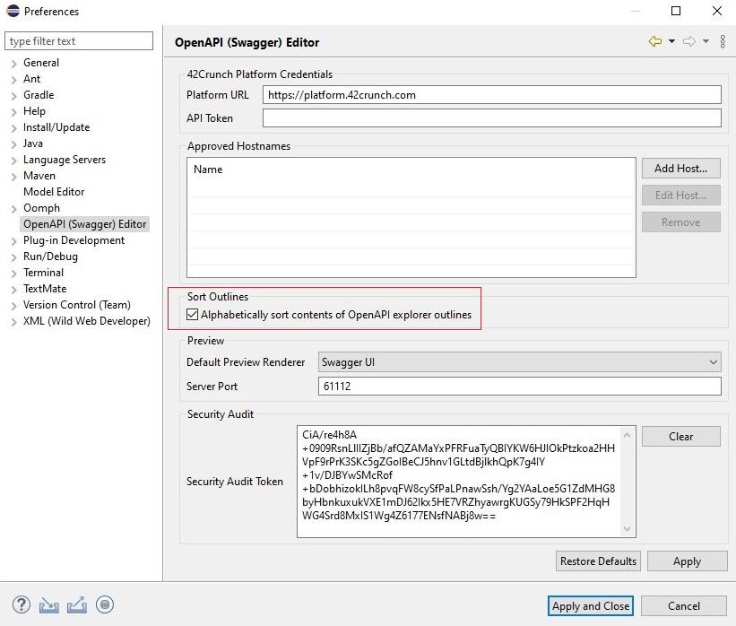

# OpenAPI extension for Eclipse

This [Eclipse](https://www.eclipse.org/) [extension](https://marketplace.eclipse.org/content/openapi-swagger-editor) adds rich support for the [OpenAPI Specification](https://github.com/OAI/OpenAPI-Specification) (OAS) (formerly known as Swagger Specification) in JSON or YAML format. The features include, for example, SwaggerUI and ReDoc preview, IntelliSense, linting, schema enforcement, code navigation, definition links, snippets, static security analysis, and more!

The extension also integrates with [API Contract Security Audit](https://docs.42crunch.com/latest/content/concepts/api_contract_security_audit.htm) by 42Crunch, so that you can check the quality of your API definition directly in Eclipse.

Both OAS v2 and v3 are supported.

## Table of contents

- [OpenAPI extension for Eclipse](#openapi-extension-for-eclipse)
  - [Table of contents](#table-of-contents)
  - [Quick start](#quick-start)
  - [Use the extension while editing your API](#use-the-extension-while-editing-your-api)
    - [Create new OpenAPI files](#create-new-openapi-files)
    - [Navigate API definition](#navigate-api-definition)
    - [Add new elements in the OpenAPI explorer](#add-new-elements-in-the-openapi-explorer)
    - [Use References Completion](#use-references-completion)
    - [Jump to a reference](#jump-to-a-reference)
    - [Sort entries in the navigation pane](#sort-entries-in-the-navigation-pane)
    - [Preview OpenAPI documentation](#preview-openapi-documentation)
  - [Use the extension to audit the security of your API](#use-the-extension-to-audit-the-security-of-your-api)
    - [Navigate the issues in the audit report](#navigate-the-issues-in-the-audit-report)
    - [Fix issues](#fix-issues)
      - [Individual fixes](#individual-fixes)
      - [Bulk fixes](#bulk-fixes)
  - [Integration with 42Crunch Platform](#integration-with-42crunch-platform)
  - [Known issues](#known-issues)
  - [Feedback](#feedback)

## Quick start

After installing the plugin, open any JSON or YAML file that contains an OpenAPI definition in Eclipse. Go to Windows / Perspective / Open Perspective and choose OpenAPI perspective.

## Use the extension while editing your API

OpenAPI extension makes it easier and faster to navigate your OpenAPI definitions, especially when they get longer.

You can home in on elements in the OpenAPI explorer view, or jump directly to the target of a reference in the API. You can also add new elements to your API directly in the OpenAPI explorer directly where they are needed.

### Create new OpenAPI files

1. Go to File / New / Other or press **Ctrl+N**.
2. In the wizard select OpenAPI and choose the corresponding item to create either an OAS v2 or v3 template file.
3. Write File name and press Finish to save the file to your disk.

### Navigate API definition

1. Open an OpenAPI file.
2. Switch to the OpenAPI explorer view.
3. Expand the sections and elements in the file as needed, and click the ones you want to jump to in the editor.

### Add new elements in the OpenAPI explorer

1. In OpenAPI explorer pane, go to the tree node where you want to add a new element (it will be marked with the [+] symbol), and right click on it.
2. Click the item you want to add from the dropdown list.

### Use References Completion

As you start typing OpenAPI ref values, the context-sensitive list of available options is displayed. In JSON OpenAPI files, just type (`#`) in double-quotes to show the menu, and type further to filter the list. In YAML OpenAPI files it is possible in single quotes also.

### Jump to a reference

Use Go to Definition to locate the targets of references easily. To jump to view the definition from a reference in your API, either **Ctrl+click** a reference, or right-click a reference and click **Go to Definition** in the shortcut menu.

### Sort entries in the navigation pane

By default, entries in the OpenAPI Explorer pane are sorted alphabetically. If you want to instead have them sorted in the order they are in the OpenAPI file, change the corresponding setting:

1. On the **Window** menu, click **Preferences > OpenAPI (Swagger) Editor**.
2. Clear the checkbox **Alphabetically sort contents of OpenAPI explorer outlines**.

### Preview OpenAPI documentation

You can get a documentation-style preview of the API you are editing by clicking the Preview button:

Our extension supports two popular OpenAPI documentation generators: [SwaggerUI](https://swagger.io/tools/swagger-ui/) and [ReDoc](https://github.com/Redocly/redoc).

To change the default OpenAPI Preview rendering engine:

1. On the **Window** menu, click **Preferences > OpenAPI (Swagger) Editor**.
2. Pick the option of your choice from the **Default Preview Rendered** dropdown list.

Note: 
1. Action is available only for syntactically valid project files.
2. Web page is opened in the default system browser.
3. Preview service port is 61112 by default, but it can be changed it in the settings wizard if needed.

## Use the extension to audit the security of your API

You can use OpenAPI extension to check the quality of your API as you work on it. You can run the audit directly from Eclipse by clicking the **42C** button in the upper right corner.

To run Security Audit from Eclipse, you need a token. On the first time, you are asked to provide your email address. When you supply the address, the extension requests the token to be sent to your mailbox. Once you get the token, paste it in the prompt in Eclipse, and you are all set. From now on, all you need to do is to click the button to run the audit.

### Navigate the issues in the audit report

After the audit finishes, you get the audit report directly in the Eclipse view, side by side with your code. Depending on your API definition, the report might be long, so here are some handy ways to navigate the found issues.

1. To scroll through all issues and their details, use either the HTML panel on the right or bottom Audit Problems panel 

2. Hover on an underlined element in your code to see what the issues in that spot are. If you click on view details of only these issues, the rest of details are filtered out from the text panel, so you have less to scroll through.

3. For a quick overall look, check the counts in the Audit Problems view. The different icons match the severity of the issue:

- Error: critical or high
- Warning: medium
- Info: low

There is a problems filter in the top right corner

4. Click the icons in the Status Bar to open the PROBLEMS panel and scroll through the issue titles. The issues are ordered from most to least severe, so it is easy for fix the worst offenders first. Note that recommendations are not listed in the PROBLEMS panel.
5. Click on an issue in the PROBLEMS panel to jump to view it inline in your API definition.

### Fix issues

Many of the issues reported by the Security Audit have Fixes associated with them. These are code snippets that you can get inserted into the OpenAPI file and then customize with the appropriate value.

#### Individual fixes

1. Perform the Security Audit by clicking the **42c** button.
2. Hover on an error line in your OpenAPI file, you will see the QuickFix icon show up.

Note: sometimes Eclipse doesn't show the QuickFix popup. In this case you can use right click context menu or press **Ctrl+1** shortcut.

3. Click the icon and select the QuickFix to apply.
4. Tweak the values in the inserted code snippet as you see fit.

#### Bulk fixes

If your OpenAPI file contains multiple similar issues - for example, a parameter with the same name is missing the pattern definition - you can fix all such occurrences in one go:

1. Fix the first occurrence and supply the proper values in the code snippet.
2. Go to the next occurrence and use the bulk QuickFix. This bulk QuickFix will reuse the values that you used previously for the parameter with the same name.

## Integration with 42Crunch Platform

This extension features optional integration with [42Crunch Platform](https://platform.42crunch.com/). To enable it please configure your [credentials](https://docs.42crunch.com/latest/content/concepts/api_tokens.htm) in the settings wizard.

Note: Platform token is stored encrypted, a user should keep all workspace data safe and secure to avoid the risk of decryption.

Then you can work with the platform using the tree view

## Known issues

- No schema validation of OpenAPI files
- Reference completion is unavailable for external references
- Generic Text Editor must be a default editor for json / yaml files to use QuickFixes
- Sometimes Eclipse doesn't show the QuickFix popup, in this case use right click context menu or press **Ctrl+1** shortcut.

## Feedback

Submit your bug reports at [GitHub project Issues](https://github.com/42Crunch/eclipse-openapi/issues).

And, needless to say, your reviews at [Eclipse marketplace](https://marketplace.eclipse.org/content/openapi-swagger-editor) mean the world to us!
